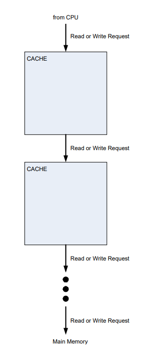

## About

In this project, a flexible cache and memory hierarchy simulator is implemented and is used to 
compare the performance, area, and energy of different memory hierarchy configurations, using 
a subset of the SPEC 2006 benchmark suite, SPEC 2017 benchmark suite, and/or 
microbenchmarks.

## Specification of Memory Hierarchy 

The generic cache module designed can be used at any level in a memory hierarchy. For 
example, this cache module can be “instantiated” as an L1 cache, an L2 cache, an L3 cache, and 
so on. 

CACHE can be configured in terms of supporting any cache size, associativity, and block 
size, specified at the beginning of simulation:
o SIZE: Total bytes of data storage.
o ASSOC: The associativity of the cache. (ASSOC = 1 is a direct-mapped cache. ASSOC 
= # blocks in the cache = SIZE/BLOCKSIZE is a fully-associative cache.)
o BLOCKSIZE: The number of bytes in a block.

### Replacement Policy

CACHE uses the LRU (least-recently-used) replacement policy.

### Write Policy

CACHE uses the WBWA (write-back + write-allocate) write policy.
o Write-allocate: A write that misses in CACHE will cause a block to be allocated in 
CACHE. Therefore, both write misses and read misses cause blocks to be allocated in 
CACHE.
o Write-back: A write updates the corresponding block in CACHE, making the block dirty. 
It does not update the next level in the memory hierarchy (next level of cache or 
memory). If a dirty block is evicted from CACHE, a writeback (i.e., a write of the entire 
block) will be sent to the next level in the memory hierarchy

## Running the Simulator
1. Type `make` to build.  (Type "make clean" first if you already compiled and want to recompile from scratch.)

2. Run trace reader:

   To run without throttling output:
   `./sim 32 8192 4 262144 8 3 10 ../example_trace.txt`

   To run with throttling (via "less"):
   `./sim 32 8192 4 262144 8 3 10 ../example_trace.txt | less`

   To run and confirm that all requests in the trace were read correctly:
   `./sim 32 8192 4 262144 8 3 10 ../example_trace.txt > echo_trace.txt
   diff ../example_trace.txt echo_trace.txt`  

	The result of `diff` should indicate that the only difference is that echo_trace.txt has the configuration information.
	0a1,10
	- ===== Simulator configuration =====
	- BLOCKSIZE:  32
	- L1_SIZE:    8192
	- L1_ASSOC:   4
	- L2_SIZE:    262144
	- L2_ASSOC:   8
	- PREF_N:     3
	- PREF_M:     10
	- trace_file: ../example_trace.txt
	- ===================================

